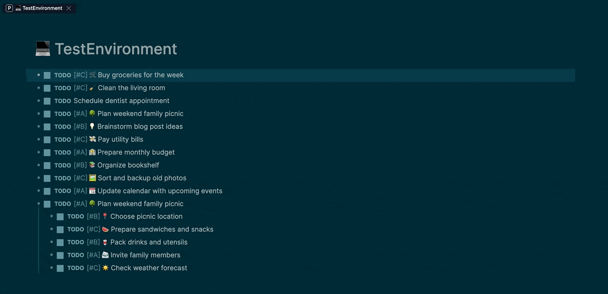
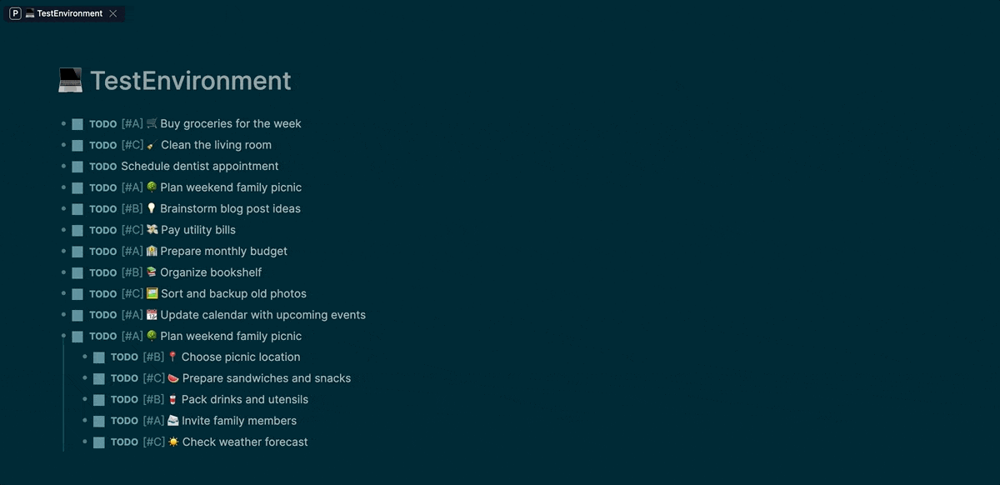
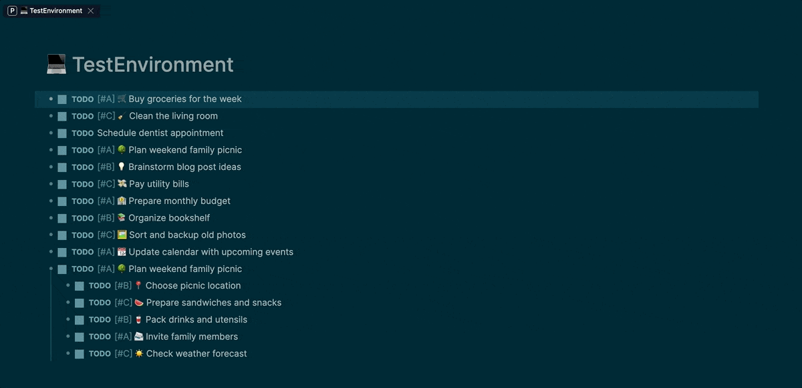

# Logseq Priority Sorter

Quickly assign A/B/C priorities and sort blocks directly in Logseq.

## Usage

| Action                     | Command / Shortcut                       |
| -------------------------- | ---------------------------------------- |
| **Priority Cycle Block**   | `/priority-cycle` or `Alt+Mod+→`         |
| **Priority Sort Page**     | `/priority-sort-page` or `Alt+Mod+↑`     |
| **Priority Sort Children** | `/priority-sort-children` or `Alt+Mod+↓` |

※ `Mod` = `⌘ (Command)` on Mac, `Ctrl` on Windows

- ### 1. Priority Cycle Block

  

Repeatedly rotates between `[#A]`, `[#B]`, `[#C]` on the current block. “Priority” here refers to importance levels: A (high), B (medium), and C (low). If no priority tag is present, the first cycle will insert `[#A]`, and subsequent cycles follow the A→B→C sequence.

- ### 2. Priority Sort Page

  

Reorders the top‑level blocks of the current page by priority: `[#A]` → `[#B]` → `[#C]` → none. Blocks without a priority tag will be placed after C.
Note: Running this command on special views (e.g., Whiteboards, Journals) will result in an error. Please use this command only on regular single pages.

- ### 3. Priority Sort Children

  

Reorders the immediate child blocks of the currently selected block by priority: `[#A]` → `[#B]` → `[#C]` → none. Child blocks without a priority tag will be placed after those tagged `[#C]`.

## Features

- One‑key, rapid‑tap friendly priority toggling
- Stable, outline‑preserving sort at page or subtree level
- Recognizes and preserves common task keywords (e.g., TODO, DONE)

---

## License

MIT © Koshiro K
